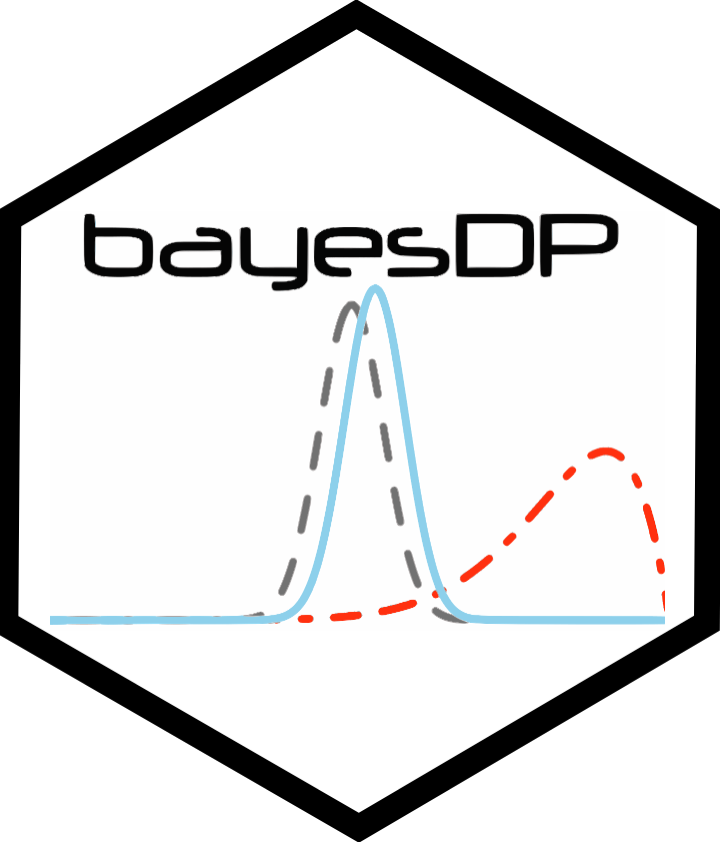

<!-- README.md is generated from README.Rmd. Please edit that file -->

```{r, echo = FALSE}
knitr::opts_chunk$set(
  collapse = TRUE,
  comment = "#>",
  fig.path = "README-"
)
```

# bayesDP 

<!-- badges: start -->
[](https://CRAN.R-project.org/package=bayesDP)
[](https://CRAN.R-project.org/package=bayesDP)
[](https://www.r-pkg.org:443/pkg/bayesDP)
[](https://www.gnu.org/licenses/gpl-3.0.html)
[](https://github.com/graemeleehickey/bayesDP/actions/workflows/R-CMD-check.yaml)
[](https://app.codecov.io/gh/graemeleehickey/bayesDP)
<!-- badges: end -->

`bayesDP` implements the Bayesian discount prior approach for borrowing
historical information in one-arm and two-arm clinical trials. The package
supports binomial, normal, survival, linear-model, and logistic-regression
settings, and provides plotting and summary methods for inspecting posterior
estimates and discount weights.

The method adaptively discounts historical information according to the
agreement between current and historical data. See Haddad et al. (2017)
(<doi:10.1080/10543406.2017.1300907>) for methodological details.

## Links

* Package website: <https://graemeleehickey.github.io/bayesDP/>
* Source code: <https://github.com/graemeleehickey/bayesDP>
* CRAN: <https://CRAN.R-project.org/package=bayesDP>
* Issues: <https://github.com/graemeleehickey/bayesDP/issues>

## Installation

Install the released version from CRAN:

```{r, eval=FALSE}
install.packages("bayesDP")
```

Install the development version from GitHub:

```{r, eval=FALSE}
# install.packages("remotes")
remotes::install_github("graemeleehickey/bayesDP")
```

## Supported analyses

| Function | Outcome / model | Typical use |
|---|---|---|
| `bdpbinomial()` | Binomial response | Event rates and proportions |
| `bdpnormal()` | Normal summary statistics | Continuous endpoints with known summaries |
| `bdpsurvival()` | Survival response | Time-to-event endpoints |
| `bdplm()` | Linear model | Individual-level continuous outcomes |
| `bdplogit()` | Logistic regression | Individual-level binary outcomes |

## Basic examples

### Binomial endpoint

```{r}
library(bayesDP)

fit_bin <- bdpbinomial(
  y_t = 10, N_t = 500,
  y0_t = 25, N0_t = 250,
  method = "fixed"
)

summary(fit_bin)
```

### Normal endpoint

```{r}
fit_norm <- bdpnormal(
  mu_t = 30, sigma_t = 10, N_t = 250,
  mu0_t = 50, sigma0_t = 5, N0_t = 250,
  method = "fixed"
)

summary(fit_norm)
```

### Individual-level linear model

```{r}
set.seed(2710)
n_t <- 30
n_c <- 30
n_t0 <- 80
n_c0 <- 80

treatment <- c(rep(1, n_t), rep(0, n_c))
treatment0 <- c(rep(1, n_t0), rep(0, n_c0))
x <- rnorm(n_t + n_c, 1, 5)
x0 <- rnorm(n_t0 + n_c0, 1, 5)

Y <- 10 + 31 * treatment + 3 * x + rnorm(n_t + n_c, 0, 5)
Y0 <- 10 + 30 * treatment0 + 3 * x0 + rnorm(n_t0 + n_c0, 0, 5)

df <- data.frame(Y = Y, treatment = treatment, x = x)
df0 <- data.frame(Y = Y0, treatment = treatment0, x = x0)

fit_lm <- bdplm(Y ~ treatment + x, data = df, data0 = df0, method = "fixed")
summary(fit_lm)
```

## Citation

If you use `bayesDP`, please cite the package and the methodological paper:

```{r, eval=FALSE}
citation("bayesDP")
```
