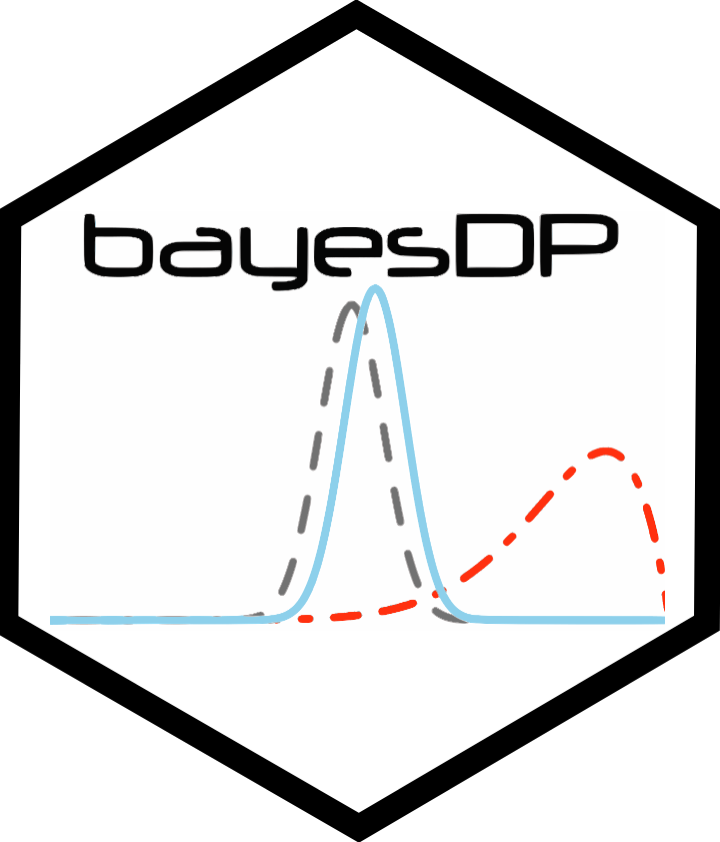

<!-- README.md is generated from README.Rmd. Please edit that file -->

# bayesDP 

<!-- badges: start -->

[](https://CRAN.R-project.org/package=bayesDP)
[](https://CRAN.R-project.org/package=bayesDP)
[](https://www.r-pkg.org:443/pkg/bayesDP)
[](https://www.gnu.org/licenses/gpl-3.0.html)
[](https://app.codecov.io/gh/graemeleehickey/bayesDP?branch=master)
[](https://ci.appveyor.com/project/graemeleehickey/bayesDP)
[](https://github.com/graemeleehickey/bayesDP/actions)
<!-- badges: end -->

`bayesDP` provides tools and functions for data augmentation using the
Bayesian discount prior function for one arm and two arm clinical
trials.

## CRAN Installation

Install release version from CRAN:

``` r
install.packages("bayesDP")
```

## GitHub Installation

Install development version from GitHub:

``` r
devtools::install_github("graemeleehickey/bayesDP")
```
