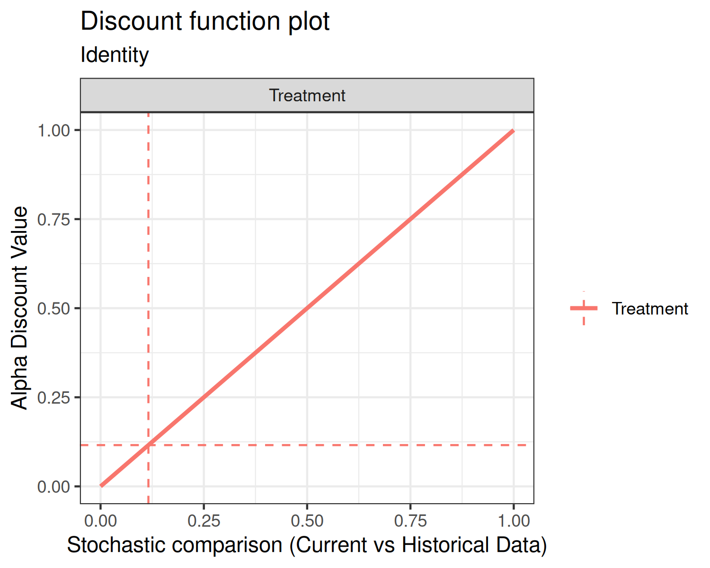
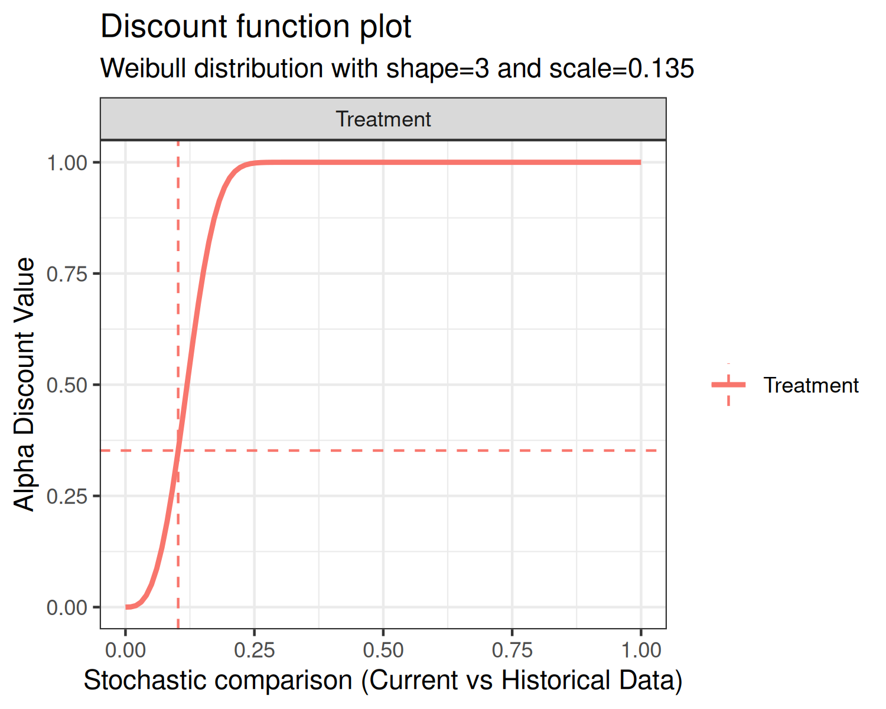
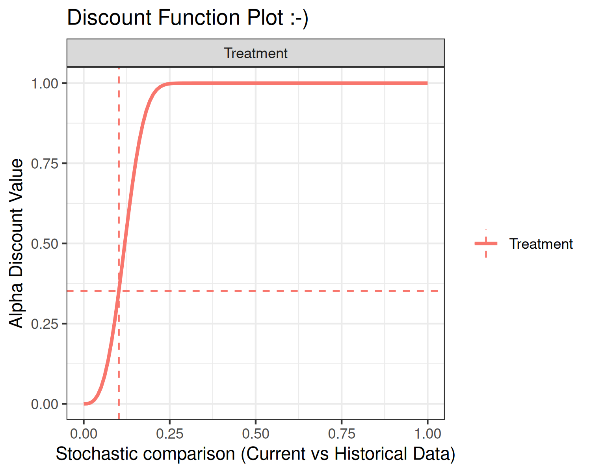
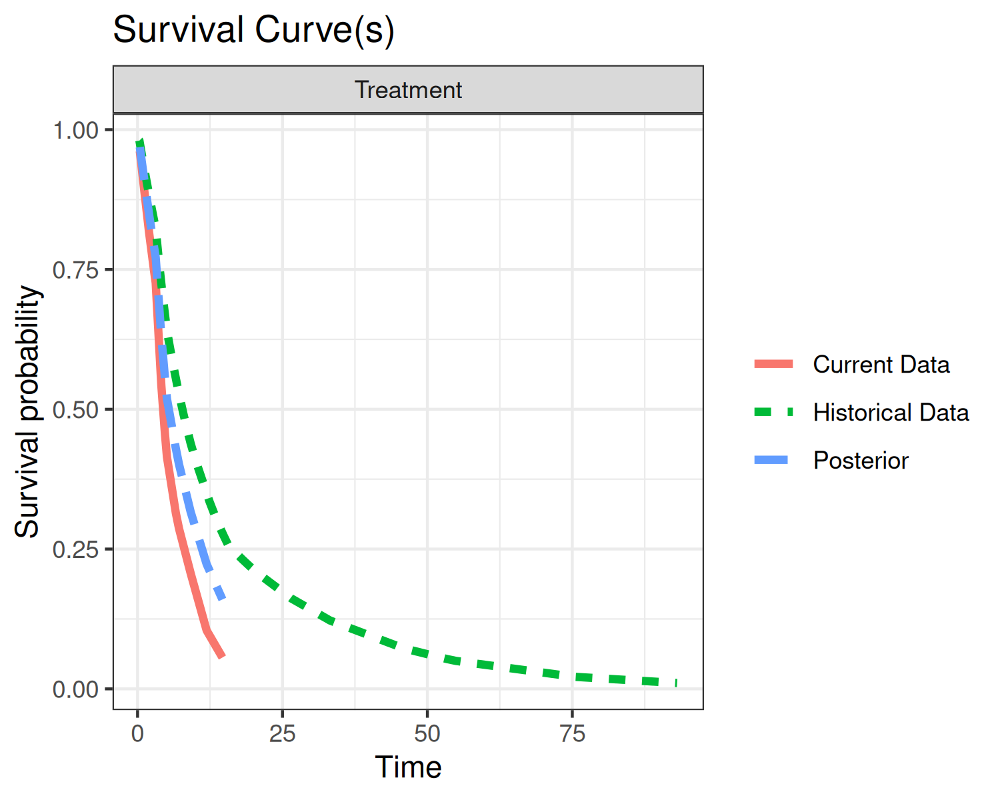
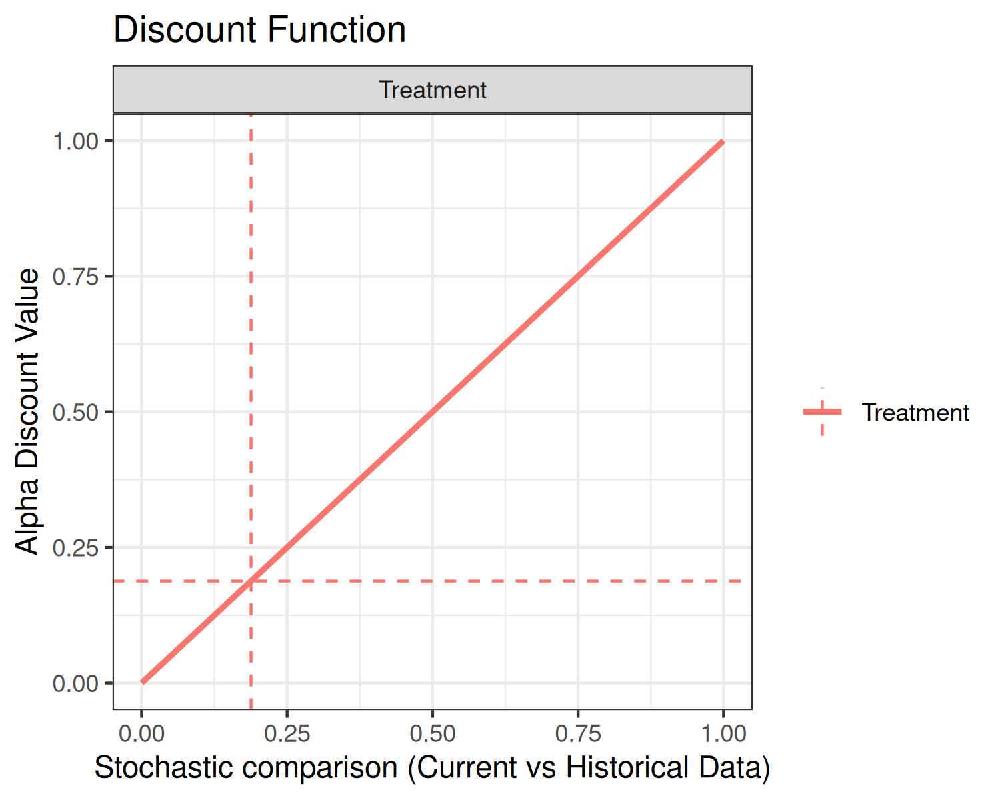

# BayesDP

## Introduction

The purpose of this vignette is to introduce the `bdpsurvival` function.
`bdpsurvival` is used for estimating posterior samples in the context of
right-censored data for clinical trials where an informative prior is
used. The underlying model is a piecewise exponential model that assumes
a constant hazard rate for each of several sub-intervals of the time to
follow-up. In the parlance of clinical trials, the informative prior is
derived from historical data. The weight given to the historical data is
determined using what we refer to as a discount function. There are
three steps in carrying out estimation:

1.  Estimation of the historical data weight, denoted $`\hat{\alpha}`$,
    via the discount function

2.  Estimation of the posterior distribution of the current data,
    conditional on the historical data weighted by $`\hat{\alpha}`$

3.  If a two-arm clinical trial, estimation of the posterior treatment
    effect, i.e., treatment versus control

Throughout this vignette, we use the terms `current`, `historical`,
`treatment`, and `control`. These terms are used because the model was
envisioned in the context of clinical trials where historical data may
be present. Because of this terminology, there are 4 potential sources
of data:

1.  Current treatment data: treatment data from a current study

2.  Current control data: control (or other treatment) data from a
    current study

3.  Historical treatment data: treatment data from a previous study

4.  Historical control data: control (or other treatment) data from a
    previous study

If only treatment data is input, the function considers the analysis a
one-arm trial. If treatment data + control data is input, then it is
considered a two-arm trial.

### Piecewise Exponential Model Background

Before we get into our estimation scheme, we will briefly describe the
piecewise exponential model. First, we partition the time duration into
$`J`$ intervals with cutpoints (or breaks)
$`0=\tau_0<\tau_1<\dots<\tau_J=\infty`$. The $`j`$th interval is defined
as $`[\tau_{j-1},\,\tau_j)`$. Then, we let $`\lambda_j`$ denote the
hazard rate of the $`j`$th interval. That is, we assume that the hazard
rate is piecewise constant.

Now, let $`d_{ij}`$ be an event indicator for the $`i`$th subject in the
$`j`$th interval. That is, $`d_{ij}=1`$ if the endpoint occurred in the
$`j`$th interval, otherwise $`d_{ij}=0`$. Let $`t_{ij}`$ denote the
exposure time of the $`i`$th subject in the $`j`$th interval.

Let $`D_j=\sum_id_{ij}`$ be the number of episodes that occurred in
interval $`j`$, and let $`T_j=\sum_it_{ij}`$ be the total exposure time
within interval $`j`$. Then, the $`j`$th hazard rate is estimated as
``` math
\lambda_j\mid D_j, \sim \mathcal{G}amma\left(a_0+D_j,\,b_0+T_j\right),
```
where $`a_0`$ and $`b_0`$ are the prior shape and rate parameters of a
gamma distribution. The survival probability can be estimated as
``` math
p_S = 1-F_p\left(q,\,\lambda_1,\dots,\,\lambda_J,\,\tau_0,\,\dots\,\,\tau_J\right),
```
where $`F_p`$ is the piecewise exponential cumulative distribution
function.

In the case where a covariate effect is present, a slightly different
approach is used. In the `bdpsurvival` function, a covariate effect
arises in the context of a two-arm trial where the covariate of interest
is the treatment indicator, i.e., treatment vs. control. In that case,
we assume a Poisson glm model of the form
``` math
\log\mathbb{E}\left(d_{ij}\mid\lambda_j,\,\beta\right)=\log t_{ij} + \log\lambda_j + \beta I(treatment_i),\,\,\,i=1,\dots,\,N,\,\,j=1,\dots,\,J,
```
where $`I(treatment_i)`$ is a treatment indicator for the $`i`$th
subject. In this context, $`\beta`$ is the $`\log`$ hazard rate between
the treatment and control arms. With the Poisson glm, we use an
approximation to estimate $`\beta`$ conditional on each $`\lambda_j`$.
Suppose we estimate hazard rates for the treatment and controls arms
independently, denoted $`\lambda_{jT}`$ and $`\lambda_{jC}`$,
respectively. That is
``` math
\lambda_{jT} \sim \mathcal{G}amma\left(a_0+D_{jT},\,b_0+T_{jT}\right)
```
and
``` math
\lambda_{jC} \sim \mathcal{G}amma\left(a_0+D_{jC},\,b_0+T_{jC}\right),
```
where $`D_{jT}`$ and $`D_{jC}`$ denote the number of events occurring in
interval $`j`$ for the treatment and control arms, respectively, and
$`T_{jT}`$ and $`T_{jC}`$ denote the total exposures times in interval
$`j`$ for the treatment and control arms, respectively. Then, an
approximation of the log-hazard rate $`\beta`$ is carried out as
follows:
``` math
\begin{array}{rcl}
R_j & = & \log\lambda_{jT}-\log\lambda_{jC},\,\,\,j=1,\dots,\,J,\\
\\
V_j & = & \mathbb{V}ar(R_j),\,\,\,j=1,\dots,\,J,\\
\\
\beta & = & \displaystyle{\frac{\sum_jR_j/V_j}{\sum_j1/V_j}}.\\
\end{array}
```
This estimate of $`\beta`$ is a normal approximation to the estimate
under a Poisson glm. Currently, the variance term $`V_j`$ is estimated
empirically by calculating the variance of the posterior draws. The
empirical variance approximates the theoretical variance under a normal
approximation of
``` math
\begin{array}{rcl}
\tilde{V}_j & = & V_{jT} + V_{jC},\\
\\
V_{jT} & = & 1/D_{jT},\\
\\
V_{jC} & = & 1/D_{jC}.\\
\end{array}
```

### Estimation of the historical data weight

In the first estimation step, the historical data weight
$`\hat{\alpha}`$ is estimated. In the case of a two-arm trial, where
both treatment and control data are available, an $`\hat{\alpha}`$ value
is estimated separately for each of the treatment and control arms. Of
course, historical treatment or historical control data must be present,
otherwise $`\hat{\alpha}`$ is not estimated for the corresponding arm.

When historical data are available, estimation of $`\hat{\alpha}`$ is
carried out as follows. Let $`d_{ij}`$ and $`t_{ij}`$ denote the the
event indicator and event time or censoring time for the $`i`$th subject
in the $`j`$th interval of the current data, respectively. Similarly,
let $`d_{0ij}`$ and $`t_{0ij}`$ denote the the event indicator and event
time or censoring time for the $`i`$th subject in the $`j`$th interval
of the historical data, respectively. Let $`a_0`$ and $`b_0`$ denote the
shape and rate parameters of a gamma distribution, respectively. Then,
the posterior distributions of the $`j`$th piecewise hazard rates for
current and historical data, under vague (flat) priors are

``` math
\lambda_{j} \sim \mathcal{G}amma\left(a_0+D_j,\,b_0+T_j\right),
```

``` math
\lambda_{0j} \sim \mathcal{G}amma\left(a_0+D_{0j},\,b_0+T_{0j}\right)
```
respectively, where $`D_j=\sum_id_{ij}`$, $`T_j=\sum_it_{ij}`$,
$`D_{0j}=\sum_id_{0ij}`$, and $`T_{j0}=\sum_it_{0ij}`$. The next steps
are dependent on whether a one-arm or two-arm analysis is requested.

#### Estimation under a one-arm analysis

Under a one-arm analysis, the comparison of interest is the survival
probability at user-specified time $`t^\ast`$. Let
``` math
\tilde{\theta} = 1-F_p\left(t^\ast,\,\lambda_1,\dots,\,\lambda_J,\,\tau_0,\,\dots\,\,\tau_J\right),
```
and
``` math
\theta_0 = 1-F_p\left(t^\ast,\,\lambda_{01},\dots,\,\lambda_{0J},\,\tau_0,\,\dots\,\,\tau_J\right),
```
be the posterior survival probabilities for the current and historical
data, respectively. Then, we compute the posterior probability that the
current survival is greater than the historical survival
$`p = Pr\left(\tilde{\theta} \ne \theta_0 \mid D, T, D_0,T_0 \right)`$,
where $`D`$ and $`T`$ collect $`D_1,\dots,D_J`$ and $`T_1,\dots,T_J`$,
respectively.

#### Estimation under a two-arm analysis

Under a two-arm analysis, the comparison of interest is the hazard ratio
of current vs. historical data. We estimate the log hazard ratio
$`\beta`$ as described previously and compute the posterior probability
that $`\beta \ne 0`$ as
$`p = Pr\left(\beta \ne 0\mid D, T, D_0, T_0\right)`$.

------------------------------------------------------------------------

Finally, for a discount function, denoted $`W`$, $`\hat{\alpha}`$ is
computed as
``` math
\hat{\alpha} = \alpha_{max}\cdot W\left(p, \,w\right),\,0\le p\le1,
```
where $`w`$ may be one or more parameters associated with the discount
function and $`\alpha_{max}`$ scales the weight $`\hat{\alpha}`$ by a
user-input maximum value. More details on the discount functions are
given in the discount function section below.

There are several model inputs at this first stage. First, the user can
select `fix_alpha=TRUE` and force a fixed value of $`\hat{\alpha}`$ (at
the `alpha_max` input), as opposed to estimation via the discount
function. Next, a Monte Carlo estimation approach is used, requiring
several samples from the posterior distributions. Thus, the user can
input a sample size greater than or less than the default value of
`number_mcmc=10000`. Next, the Beta rate parameters can be changed from
the defaults of $`a_0=b_0=1`$ (`a0` and `b0` inputs).

An alternate Monte Carlo-based estimation scheme of $`\hat{\alpha}`$ has
been implemented, controlled by the function input `method="mc"`. Here,
instead of treating $`\hat{\alpha}`$ as a fixed quantity,
$`\hat{\alpha}`$ is treated as random. For a one-arm analysis, let
$`p_1`$ denote the posterior probability. Then, $`p_1`$ is computed as

``` math
 \begin{array}{rcl}
v^2_1 & = & \displaystyle{t^{\ast2}\sum_{j=1}^{J\left(t^\ast\right)}\frac{\lambda_{j}^{2}}{D_{j}}} ,\\
\\
v^2_{01} & = & \displaystyle{t^{\ast2}\sum_{j=1}^{J\left(t^\ast\right)}\frac{\lambda_{0j}^{2}}{D_{0j}}} ,\\
\\
Z_1 & = & \displaystyle{\frac{\left|\tilde{\theta}-\theta_0\right|}{\sqrt{v^2_1 + v^2_{01}}}} ,\\
\\
p_1 &  =  & 2\left(1-\Phi\left(Z_1\right)\right),
\end{array}
```

where $`\Phi\left(x\right)`$ is the $`x`$th quantile of a standard
normal (i.e., the `pnorm` R function). Here, $`v_1^2`$ and $`v^2_{01}`$
are estimates of the variances of $`\tilde{\theta}`$ and $`\theta_0`$,
respectively. Next, $`p_1`$ is used to construct $`\hat{\alpha}`$ via
the discount function. Since the values $`Z_1`$ and $`p_1`$ are computed
at each iteration of the Monte Carlo estimation scheme, $`\hat{\alpha}`$
is computed at each iteration of the Monte Carlo estimation scheme,
resulting in a distribution of $`\hat{\alpha}`$ values.

For a two-arm analysis, let $`p_2`$ denote the posterior probability.
Then, $`p_2`$ is computed as

``` math
 \begin{array}{rcl}
v^2_{2j} & = & \left(a_0 + D_j\right)^{-1},\, j=1,\dots,J,\\
\\
v^2_{02j} & = & \left(a_0 + D_{0j}\right)^{-1},\, j=1,\dots,J,\\
\\
\tilde{R} & = & \displaystyle{   \left(\sum_{j=1}^J\frac{\log\lambda_j-\log\lambda_{0j} }{1/v^2_{2j} + 1/v^2_{02j}}\right)  \left(\sum_{j=1}^J\frac{1}{1/v^2_{2j} + 1/v^2_{02j}}\right)^{-1}   } ,\\
\\
Z_2 & = & \displaystyle{\left|\tilde{R}\right|\left(\sum_{j=1}^J\frac{1}{1/v^2_{2j} + 1/v^2_{02j}}\right)^{-1/2}  } ,\\
\\
p_2 &  =  & 2\left(1-\Phi\left(Z_2\right)\right),
\end{array}
```
where $`\Phi\left(x\right)`$ is the $`x`$th quantile of a standard
normal. Here, $`v^2_{2j}`$ and $`v^2_{02j}`$ are estimates of the
variances of $`\log\lambda_j`$ and $`\log\lambda_{0j}`$, respectively.
Next, $`p_2`$ is used to construct $`\hat{\alpha}`$ via the discount
function. Since the values $`Z_2`$ and $`p_2`$ are computed at each
iteration of the Monte Carlo estimation scheme, $`\hat{\alpha}`$ is
computed at each iteration of the Monte Carlo estimation scheme,
resulting in a distribution of $`\hat{\alpha}`$ values.

#### Discount function

There are currently three discount functions implemented throughout the
`bayesDP` package. The discount function is specified using the
`discount_function` input with the following choices available:

1.  `identity` (default): Identity.

2.  `weibull`: Weibull cumulative distribution function (CDF);

3.  `scaledweibull`: Scaled Weibull CDF;

First, the identity discount function (default) sets the discount weight
$`\hat{\alpha}=p`$.

Second, the Weibull CDF has two user-specified parameters associated
with it, the shape and scale. The default shape is 3 and the default
scale is 0.135, each of which are controlled by the function inputs
`weibull_shape` and `weibull_scale`, respectively. The form of the
Weibull CDF is
``` math
W(x) = 1 - \exp\left\{- (x/w_{scale})^{w_{shape}}\right\}.
```

The third discount function option is the Scaled Weibull CDF. The Scaled
Weibull CDF is the Weibull CDF divided by the value of the Weibull CDF
evaluated at 1, i.e.,
``` math
W^{\ast}(x) = W(x)/W(1).
```
Similar to the Weibull CDF, the Scaled Weibull CDF has two
user-specified parameters associated with it, the shape and scale, again
controlled by the function inputs `weibull_shape` and `weibull_scale`,
respectively.

Using the default shape and scale inputs, each of the discount functions
are shown below.




In each of the above plots, the x-axis is the stochastic comparison
between current and historical data, which we’ve denoted $`p`$. The
y-axis is the discount value $`\hat{\alpha}`$ that corresponds to a
given value of $`p`$.

An advanced input for the plot function is `print`. The default value is
`print = TRUE`, which simply returns the graphics. Alternately, users
can specify `print = FALSE`, which returns a `ggplot2` object. Below is
an example using the discount function plot:

``` r

p1 <- plot(fit02, type="discount", print=FALSE)
p1 + ggtitle("Discount Function Plot :-)")
```



### Estimation of the posterior distribution of the current data, conditional on the historical data

The posterior distribution is dependent on the analysis type: one-arm or
two-arm analysis.

#### Estimation under a one-arm analysis

With $`\hat{\alpha}`$ in hand, we can now estimate the posterior
distributions of the hazards so that we can estimate the survival
probability as described previously. Using the notation of the previous
sections, the posterior distribution is
``` math
\begin{array}{rcl}
p_S & = & 1-F_p\left(t^\ast,\,\lambda_1,\dots,\,\lambda_J,\,\tau_0,\,\dots\,\,\tau_J\right),\\
\\
\lambda_j & \sim & \mathcal{G}amma\left(a_0+\sum_id_{ij} + \hat{\alpha}\sum_id_{0ij},\,b_0+\sum_it_{ij} + \hat{\alpha}\sum_it_{0ij}\right),\,j=1,\dots,J\\
\end{array}
```
At this model stage, we have in hand `number_mcmc` simulations from the
augmented posterior distribution and we then generate posterior
summaries.

#### Estimation under a two-arm analysis

Again, under a two-arm analysis, and with $`\hat{\alpha}`$ in hand, we
can now estimate the posterior distribution of the log hazard rate
comparing treatment and control. Let $`\lambda_{jT}`$ and
$`\lambda_{jC}`$ denote the hazard associated with the treatment and
control data for the $`j`$th interval, respectively. Then we augment
each of the treatment and control data by the weighted historical data
as
``` math
\begin{array}{rcl}
\lambda_{jT} & \sim & \mathcal{G}amma\left(a_0+\sum_id_{ijT} + \hat{\alpha}_T\sum_id_{0ijT},\,b_0+\sum_it_{ijT} + \hat{\alpha}_T\sum_it_{0ijT}\right),\,j=1,\dots,J\\
\end{array}
```
and
``` math
\begin{array}{rcl}
\lambda_{jC} & \sim & \mathcal{G}amma\left(a_0+\sum_id_{ijC} + \hat{\alpha}_C\sum_id_{0ijC},\,b_0+\sum_it_{ijC} + \hat{\alpha}_C\sum_it_{0ijC}\right),\,j=1,\dots,J\\
\end{array}
```
respectively. We then construct the log hazard ratio $`\beta`$ using the
estimates of $`\lambda_{jT}`$ and $`\lambda_{jC}`$, $`j=1,\dots,\,J`$ as
described previously. At this model stage, we have in hand `number_mcmc`
simulations from the augmented posterior distribution and we then
generate posterior summaries.

### Inputting Data

Data for `bdpsurvival` is input via data frame(s) that must have certain
columns. Though `bdpsurvival` supports analyses with no historical data,
other packages/functions should be used.

To carry out an analysis using historical data, two data frames need to
be constructed: (1) current data, input via `data`; and (2) historical
data, input via `data0`. The analysis type, i.e., one-arm vs. two-arm,
is controlled via the right-hand-side (RHS) of the formula input.

Suppose we have data frames with matching column names. The survival
times are stored in the `time` column while the event indicator is
stored in the `status` column. Then, the formula input
`Surv(time, status) ~ 1` specifies a one-arm treatment. As long as the
term `treatment` does not appear on the RHS of the formula, the analysis
will be one-arm.

Now, suppose we desire a two-arm analysis. Then, the current and
historical data frames must contain a column named exactly `treatment`.
The treatment column should be binary and indicates treatment and
control observations. Now, the formula input
`Surv(time, status) ~ treatment` specifies a two-arm treatment.

## Examples

### One-arm trial

To demonstrate a one-arm trial, we will simulate a small survival
dataset from an exponential distribution. For ease of exposition, we
will assume that there are no censored observations.

``` r

set.seed(42)
# Simulate survival times for current and historical data
surv_1arm <- data.frame(status = 1,
                        time   = rexp(10, rate=1/10))

# Simulate survival times for historical data
surv_1arm0 <- data.frame(status = 1,
                         time   = rexp(50, rate=1/11))
```

In this example, we’ve simulated current survival times from an
exponential distribution with rate `1/10` and historical survival times
from an exponential distribution with rate `1/11`; `status = 1` for all
observations, implying no times are censored. With our data frame
constructed, we can now fit the `bdpsurvival` model. Since this is a
one-arm trial, we will request the survival probability at
`surv_time=5`. Thus, estimation using the default model inputs is
carried out:

``` r

set.seed(42)
fit1 <- bdpsurvival(Surv(time, status) ~ 1,
                    data  = surv_1arm,
                    data0 = surv_1arm0,
                    surv_time = 5,
                    method = "fixed")
print(fit1)
```

    ## 
    ##     One-armed bdp survival
    ## 
    ## 
    ##   n events surv_time median lower 95% CI upper 95% CI
    ##  10     10         5 0.5259       0.3179       0.7355

The `print` method displays the median survival probability of `0.5259`
and the 95% lower and upper interval limits of `0.3179` and `0.7355`,
respectively. The `summary` method is implemented as well. For a one-arm
trial, the summary outputs a survival table for the current data as
follows:

``` r

summary(fit1)
```

    ## 
    ##     One-armed bdp survival
    ## 
    ## Stochastic comparison (p_hat) - treatment (current vs. historical data): 0.188
    ## Discount function value (alpha) - treatment: 0.188
    ## 
    ## Current treatment - augmented posterior summary:
    ##     time n.risk n.event survival std.err lower 95% CI upper 95% CI
    ##   0.3819     23       1   0.9688  0.0149       0.9323       0.9894
    ##   1.9834     22       1   0.8483  0.0656       0.6948       0.9464
    ##   2.8349     21       1   0.7905  0.0860       0.5942       0.9243
    ##   3.1278     20       0   0.7715  0.0921       0.5631       0.9168
    ##   3.1398     13       1   0.7699  0.0919       0.5619       0.9143
    ##   4.1013     12       1   0.6294  0.0938       0.4360       0.8006
    ##   4.7318     11       1   0.5551  0.1037       0.3502       0.7543
    ##   5.0666     10       0   0.5189  0.1088       0.3096       0.7311
    ##   6.6090      6       1   0.4294  0.0992       0.2425       0.6301
    ##   7.1486      5       1   0.4016  0.0990       0.2194       0.6074
    ##   9.1584      4       0   0.3165  0.1016       0.1424       0.5365
    ##  11.9160      2       1   0.2230  0.0823       0.0933       0.4091
    ##  14.6363      1       1   0.1599  0.0759       0.0513       0.3425

In the above output, in addition to a survival table, we can see the
stochastic comparison between the current and historical data of `0.188`
as well as the weight, alpha, of `0.188` applied to the historical data.
Here, the weight applied to the historical data is low since the
stochastic comparison suggests that the current and historical data are
not similar.

Suppose that we would like to apply full weight to the historical data.
This can be accomplished by setting `alpha_max=1` and `fix_alpha=TRUE`
as follows:

``` r

set.seed(42)
fit1a <- bdpsurvival(Surv(time, status) ~ 1,
                    data  = surv_1arm,
                    data0 = surv_1arm0,
                    surv_time = 5,
                    alpha_max = 1,
                    fix_alpha = TRUE,
                    method = "fixed")

print(fit1a)
```

    ## 
    ##     One-armed bdp survival
    ## 
    ## 
    ##   n events surv_time median lower 95% CI upper 95% CI
    ##  10     10         5 0.6041       0.4762         0.72

Now, the median survival probability shifts upwards towards the
historical data.

Many of the the values presented in the `summary` and `print` methods
are accessible from the fit object. For instance, `alpha` is found in
`fit1a$posterior_treatment$alpha_discount` and `p_hat` is located at
`fit1a$posterior_treatment$p_hat`. The augmented survival probability
and CI are computed at run-time. The results can be replicated as:

``` r

survival_time_posterior <- ppexp(5,
                                 fit1a$posterior_treatment$posterior_hazard,
                                 cuts=c(0,fit1a$args1$breaks))
surv_augmented <- 1-median(survival_time_posterior)
CI95_augmented <- 1-quantile(survival_time_posterior, prob=c(0.975, 0.025))
```

Here, we first compute the piecewise exponential cumulative distribution
function using the `ppexp` function. The `ppexp` function requires the
survival time, `5` here, the posterior draws of the piecewise hazards,
and the cuts points of the corresponding intervals.

Finally, we’ll explore the `plot` method.

``` r

plot(fit1, type="survival")
```



``` r

plot(fit1, type="discount")
```

 The
top plot displays three survival curves. The green curve is the survival
of the historical data, the red curve is the survival of the current
event rate, and the blue curve is the survival of the current data
augmented by historical data. Since we gave full weight to the
historical data, the augmented curve is “in-between” the current and
historical curves.

The bottom plot displays the discount function (solid curve) as well as
`alpha` (horizontal dashed line) and `p_hat` (vertical dashed line). In
the present example, the discount function is the identity.

### Two-arm trial

On to two-arm trials. In this package, we define a two-arm trial as an
analysis where a current and/or historical control arm is present.
Suppose we have the same treatment data as in the one-arm example, but
now we introduce control data. Again, we will assume that there is no
censoring present in the control data:

``` r

set.seed(42)
# Simulate survival times for treatment data
time_current_trt    <- rexp(10, rate=1/10)
time_historical_trt <- rexp(50, rate=1/11)

# Simulate survival times for control data
time_current_cntrl    <- rexp(10, rate=1/12)
time_historical_cntrl <- rexp(50, rate=1/12)


# Combine simulated data into data frames
surv_2arm <- data.frame(treatment = c(rep(1,10),rep(0,10)),
                        time      = c(time_current_trt, time_current_cntrl),
                        status    = 1)

surv_2arm0 <- data.frame(treatment = c(rep(1,50),rep(0,50)),
                         time      = c(time_historical_trt, time_historical_cntrl),
                         status    = 1)
```

In this example, we’ve simulated current and historical control survival
times from exponential distributions with rate `1/12`. Note how the data
frames have been constructed; we’ve taken care to ensure that the
current/historical and treatment/control indicators line up properly.
With our data frame constructed, we can now fit the `bdpsurvival` model.
Before proceeding, it is worth pointing out that the discount function
is applied separately to the treatment and control data. Now, let’s
carry out the two-arm analysis using default inputs:

``` r

set.seed(42)
fit2 <- bdpsurvival(Surv(time, status) ~ treatment,
                    data = surv_2arm,
                    data0 = surv_2arm0,
                    method = "fixed")
print(fit2)
```

    ## 
    ##     Two-armed bdp survival
    ## 
    ## data:
    ##   Current treatment: n = 23, number of events = 10
    ##   Current control: n = 24, number of events = 10
    ## Stochastic comparison (p_hat) - treatment (current vs. historical data): 0.1264
    ## Stochastic comparison (p_hat) - control (current vs. historical data): 0.0618
    ## Discount function value (alpha) - treatment: 0.1264
    ## Discount function value (alpha) - control: 0.0618
    ## 
    ##             coef exp(coef) se(coef) lower 95% CI upper 95% CI
    ## treatment -0.151    0.8599   0.4122      -0.9542       0.6606

The `print` method of a two-arm analysis is largely different than a
one-arm analysis (with a two-arm analysis, the `summary` method is
identical to `print`). First, we see the stochastic comparisons reported
for both the treatment and control arms. As seen previously, the
stochastic comparison between the current and historical data for the
treatment data is relatively small at `0.1264`, giving a low historical
data weight of `0.1264`. Similarly, the stochastic comparison between
the current and historical data for the control data is relatively low
at `0.0618`, giving a low historical data weight of `0.0618`. Finally,
the presented `coef` value (and associated interval limits) is the log
hazard ratio between the augmented treatment data and the augmented
control data computed as `log(treatment) - log(control)`.
