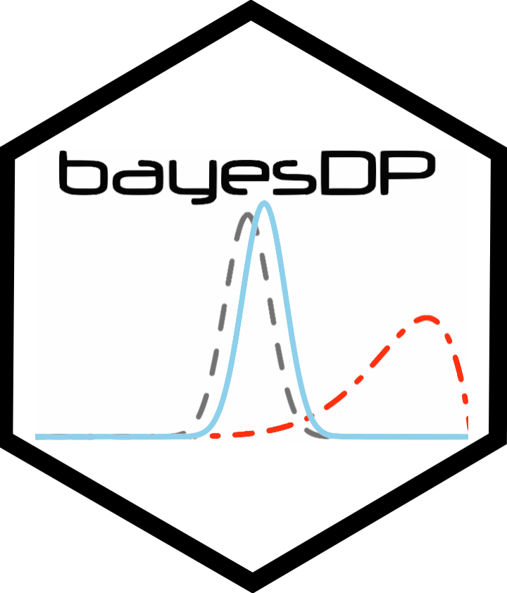

# bayesDP 

`bayesDP` implements the Bayesian discount prior approach for borrowing
historical information in one-arm and two-arm clinical trials. The
package supports binomial, normal, survival, linear-model, and
logistic-regression settings, and provides plotting and summary methods
for inspecting posterior estimates and discount weights.

The method adaptively discounts historical information according to the
agreement between current and historical data. See [Haddad et
al. (2017)](https://www.tandfonline.com/doi/full/10.1080/10543406.2017.1300907)
for methodological details.

## Links

- Package website: <https://graemeleehickey.github.io/bayesDP/>
- Source code: <https://github.com/graemeleehickey/bayesDP>
- CRAN: <https://CRAN.R-project.org/package=bayesDP>
- Issues: <https://github.com/graemeleehickey/bayesDP/issues>

## Installation

Install the released version from CRAN:

``` r

install.packages("bayesDP")
```

Install the development version from GitHub:

``` r

# install.packages("remotes")
remotes::install_github("graemeleehickey/bayesDP")
```

## Supported analyses

| Function | Outcome / model | Typical use |
|----|----|----|
| [`bdpbinomial()`](https://graemeleehickey.github.io/bayesDP/reference/bdpbinomial.md) | Binomial response | Event rates and proportions |
| [`bdpnormal()`](https://graemeleehickey.github.io/bayesDP/reference/bdpnormal.md) | Normal summary statistics | Continuous endpoints with known summaries |
| [`bdpsurvival()`](https://graemeleehickey.github.io/bayesDP/reference/bdpsurvival.md) | Survival response | Time-to-event endpoints |
| [`bdplm()`](https://graemeleehickey.github.io/bayesDP/reference/bdplm.md) | Linear model | Individual-level continuous outcomes |
| [`bdplogit()`](https://graemeleehickey.github.io/bayesDP/reference/bdplogit.md) | Logistic regression | Individual-level binary outcomes |

## Basic examples

### Binomial endpoint

``` r

library(bayesDP)
#> Loading required package: ggplot2
#> Loading required package: survival

fit_bin <- bdpbinomial(
  y_t = 10, N_t = 500,
  y0_t = 25, N0_t = 250,
  method = "fixed"
)

summary(fit_bin)
#> 
#>     One-armed bdp binomial
#> 
#> Current treatment data: 10 and 500
#> Historical treatment data: 25 and 250
#> Stochastic comparison (p_hat) - treatment (current vs. historical data): 0
#> Discount function value (alpha) - treatment: 0
#> 95 percent CI: 
#>  0.011  0.0362
#> sample estimates:
#>  0.0211
```

### Normal endpoint

``` r

fit_norm <- bdpnormal(
  mu_t = 30, sigma_t = 10, N_t = 250,
  mu0_t = 50, sigma0_t = 5, N0_t = 250,
  method = "fixed"
)

summary(fit_norm)
#> 
#>     One-armed bdp normal
#> 
#> data:
#>   Current treatment: mu_t = 30, sigma_t = 10, N_t = 250
#>   Historical treatment: mu0_t = 50, sigma0_t = 5, N0_t = 250
#> Stochastic comparison (p_hat) - treatment (current vs. historical data): 0
#> Discount function value (alpha) - treatment: 0
#> 95 percent CI: 
#>  28.7373  31.2483
#> posterior sample estimate:
#> mean of treatment group
#>  29.9928
```

### Individual-level linear model

``` r

set.seed(2710)
n_t <- 30
n_c <- 30
n_t0 <- 80
n_c0 <- 80

treatment <- c(rep(1, n_t), rep(0, n_c))
treatment0 <- c(rep(1, n_t0), rep(0, n_c0))
x <- rnorm(n_t + n_c, 1, 5)
x0 <- rnorm(n_t0 + n_c0, 1, 5)

Y <- 10 + 31 * treatment + 3 * x + rnorm(n_t + n_c, 0, 5)
Y0 <- 10 + 30 * treatment0 + 3 * x0 + rnorm(n_t0 + n_c0, 0, 5)

df <- data.frame(Y = Y, treatment = treatment, x = x)
df0 <- data.frame(Y = Y0, treatment = treatment0, x = x0)

fit_lm <- bdplm(Y ~ treatment + x, data = df, data0 = df0, method = "fixed")
summary(fit_lm)
#> 
#> Call:
#> bdplm(formula = Y ~ treatment + x, data = df, data0 = df0, method = "fixed")
#> 
#> Residuals:
#>      Min     1Q Median    3Q   Max
#>  -11.455 -1.249  2.773 6.652 14.12
#> 
#> Coefficients:
#>             Estimate Std. Error
#> (Intercept)   9.8228     0.6956
#> treatment    32.3783     1.1265
#> x             3.1145     0.1299
#> 
#> Discount function value (alpha):
#>  treatment control
#>       0.07  0.3812
#> 
#> Residual standard error: 5.4394
```

## Citation

If you use `bayesDP`, please cite the package and the methodological
paper:

``` r

citation("bayesDP")
```
